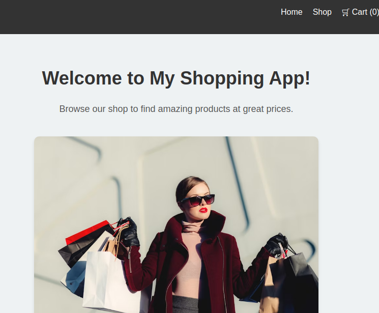
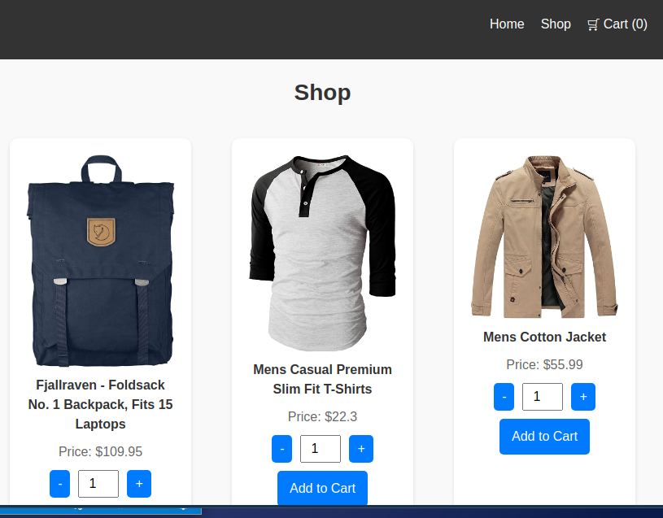

# Shopping App

Welcome to the **Shopping App**, a modern and interactive platform built using React, and Vite. This project demonstrates core concepts in React development, including state management, routing, API integration, and testing.

---

## Features

- **Home Page**: Welcoming users with a clean and responsive design.
- **Shop Page**:
  - Displays a list of products fetched from an API.
  - Allows users to increment/decrement product quantities.
  - Users can add products to the cart.
- **Cart Indicator**:
  - Displays the total number of items in the cart.
  - Accessible from the navigation bar.
- **Loading Spinner**: A spinner displayed while fetching products.
- **Error Handling**: Displays a friendly error message if the product fetch fails.
- **Testing**: Fully tested with Vitest and React Testing Library.

---

##  Technologies Used

- **Frontend**:
  - [React](https://reactjs.org/)
  - [Vite](https://vitejs.dev/)
  - [React Router](https://reactrouter.com/)
  - CSS Modules for scoped styling

- **Testing**:
  - [Vitest](https://vitest.dev/)
  - [React Testing Library](https://testing-library.com/docs/react-testing-library/intro/)

- **APIs**:
  - [FakeStore API](https://fakestoreapi.com/) (used for fetching product data)

---


### Prerequisites

Ensure you have the following installed:

- [Node.js](https://nodejs.org/) (v16 or higher recommended)
- npm or yarn package manager

### Installation

1. Clone the repository:
   ```bash
   git clone https://github.com/Ajbakaric/shopping-app.git
   ```

2. Navigate to the project directory:
   ```bash
   cd shopping-app
   ```

3. Install dependencies:
   ```bash
   npm install
   ```

4. Start the development server:
   ```bash
   npm run dev
   ```

5. Open your browser and navigate to:
   ```
   http://localhost:5173
   ```

---

##  Running Tests

The project includes comprehensive tests for components and functionality.

Run tests using:

```bash
npm test
```

---

## Project Structure

```plaintext
src/
├── components/       # Reusable React components (e.g., Navbar, ProductCard)
├── context/          # Global state management (e.g., CartContext)
├── pages/            # Page components (e.g., Home, Shop)
├── styles/           # Global styles (if applicable)
├── App.jsx           # Main app component
├── main.jsx          # Entry point
```

---

##  Screenshots

### Home Page


### Shop Page


---

##  Acknowledgments

- [The Odin Project](https://www.theodinproject.com/): For the project inspiration.
- [FakeStore API](https://fakestoreapi.com/): For providing the product data.
- [React Testing Library](https://testing-library.com/): For testing tools.

---

